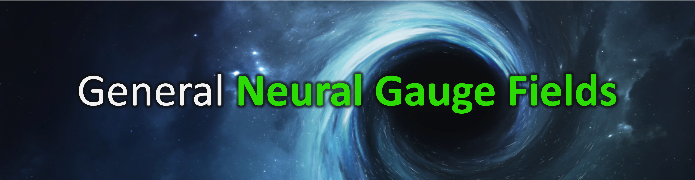

<!-- # 
General Neural Gauge Fields
 -->
# General Neural Gauge Fields

## [Paper](https://openreview.net/pdf?id=XWkWK2UagFR)  |  [Project page](https://fnzhan.com/neural-gauge-fields/)  | [Video](https://youtu.be/Enak-qXwagg)

<!-- **General Neural Gauge Fields**   -->
[Fangneng Zhan](https://fnzhan.com/), [Lingjie Liu](https://lingjie0206.github.io/), [Adam Kortylewsk](https://generativevision.mpi-inf.mpg.de/), [Christian Theobalt](https://people.mpi-inf.mpg.de/~theobalt/)  
Max Planck Institute for Informatics, Germany  

## Update
- *04/2023*: This is an initial release of basic implementation. We are working on the extension of this work, full implementation with cleaned code will be released later.
