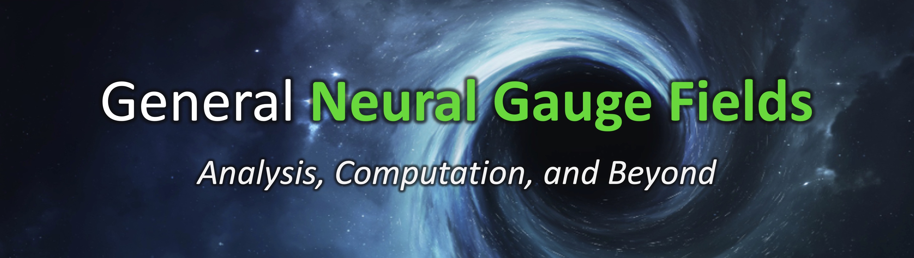
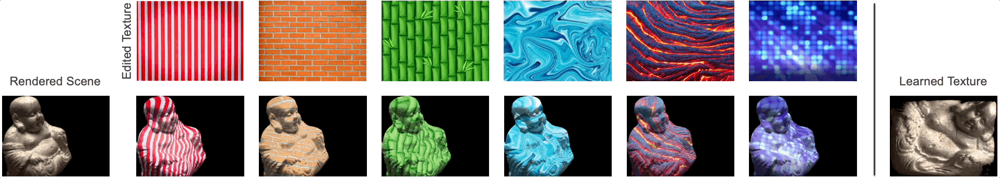

<!-- # <p align=center>General **Neural Gauge Fields**</p> -->


## [Paper](https://openreview.net/pdf?id=XWkWK2UagFR)  |  [Project page](https://fnzhan.com/Neural-Gauge-Fields/)  | [Video](https://youtu.be/Enak-qXwagg)

### **General Neural Gauge Fields** <br>
[Fangneng Zhan](https://fnzhan.com/), [Lingjie Liu](https://lingjie0206.github.io/), [Adam Kortylewsk](https://generativevision.mpi-inf.mpg.de/), [Christian Theobalt](https://people.mpi-inf.mpg.de/~theobalt/) <br>
The International Conference on Learning Representations (ICLR), 2023
<!-- Max Planck Institute for Informatics, Germany <br> -->

<!-- **Neural Gauge Fields: Analysis, Computation, and Beyond** <br>
ACM Transactions on Graphics (TOG) and SIGGRAPH, 2024 -->

## Update
- *08/2023*: We release an improved UV Mapping, which allows to learn explicit (view-dependent) texture without any regularization.
- *04/2023*: This is an initial release of basic implementation. We are working on the extension of this work, full implementation with cleaned code will be released later.

## Installation
Install environment:
```
conda create -n Gauge python=3.8
conda activate Gauge
pip install torch torchvision
pip install tqdm trimesh scikit-image opencv-python configargparse lpips imageio-ffmpeg kornia lpips tensorboard
```


## UV Mapping


The 3D coordinate is transformed to 2D manifold (e.g., sphere and square) to index neural fields, where explicit (view-dependent) 
2D texture can be obtained for scene editing. Enter UV-Mapping directory to play with it.
### 1. Dataset & Checkpoint
Five processed scenes from DTU dataset can be downloaded from [Google Drive](https://drive.google.com/file/d/1Hm2R4zH0_U9enbs-uygK3jwWXsQ7o5TQ/view?usp=sharing). <br>
The pretrained checkpoints on the five scenes can be downloaded from [Google Drive](https://drive.google.com/file/d/119sKwSshP14joo59KtsAVvrPSLw6AtQO/view?usp=drive_link). 
Saving the checkpoints in `UV-Mapping/`.
### 2. Test
To render with edited texture (e.g., for DTU scan83), run below command (you can also set the <mark>target_texture</mark> in `dtu_test.sh` to your custom texture path):
````bash
bash dtu_test.sh 83
````
To render with original texture, set the <mark>target_texture</mark> to `'None'` and run above command.
### 3. Training
Run below commands directly (you can also set <mark>data_root</mark> in `dtu_train.sh` to your custom dataset path):
````bash
bash dtu_train.sh 83
````

## Triplane Projection
Instead of applying orthogonal projection from 3D space to Triplane, we directly learn a flexible mapping with neural fields driven by rendering loss.
### 1. Training


## Todo
- ✅ Learning UV mapping for texture editing.
- ⬜️ Learning transform for Triplane and TensoRF.
- ⬜️ Learning discrete transform for hash mapping.


## Citation
If you use this code for your research, please cite our papers.
```bibtex
@inproceedings{zhan2023general,
  title={General Neural Gauge Fields},
  author={Zhan, Fangneng and Liu, Lingjie and Kortylewski, Adam and Theobalt, Christian},
  booktitle={The Eleventh International Conference on Learning Representations},
  year={2023}
}
```
