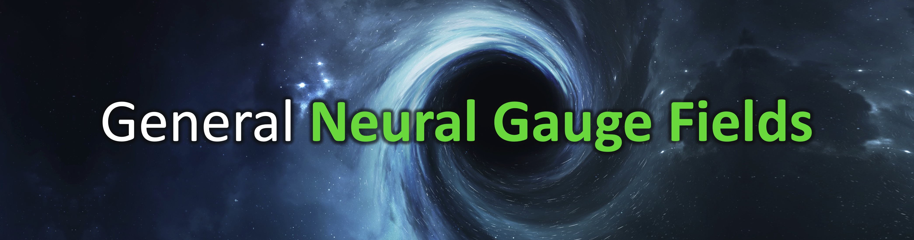

<!-- # <p align=center>General **Neural Gauge Fields**</p> -->


## [Paper](https://openreview.net/pdf?id=XWkWK2UagFR)  |  [Project page](https://fnzhan.com/Neural-Gauge-Fields/)  | [Video](https://youtu.be/Enak-qXwagg)

### **General Neural Gauge Fields**
[Fangneng Zhan](https://fnzhan.com/), [Lingjie Liu](https://lingjie0206.github.io/), [Adam Kortylewsk](https://generativevision.mpi-inf.mpg.de/), [Christian Theobalt](https://people.mpi-inf.mpg.de/~theobalt/) <br>
The International Conference on Learning Representations (ICLR), 2023
<!-- Max Planck Institute for Informatics, Germany <br> -->

<!-- **Neural Gauge Fields: Analysis, Computation, and Beyond** <br>
ACM Transactions on Graphics (TOG) and SIGGRAPH, 2024 -->

## Update
- *09/2023*: We release an improved UV Mapping and learned TriPlane projection, which allow to learn gauge transformation without any regularization.
- *04/2023*: This is an initial release of basic implementation. We are working on the extension of this work, full implementation with cleaned code will be released later.

## Installation
Install environment:
```
conda create -n Gauge python=3.8
conda activate Gauge
pip install torch torchvision
pip install tqdm trimesh scikit-image opencv-python configargparse lpips imageio-ffmpeg kornia lpips tensorboard
```

<br>

## Learning UV Mapping

The 3D coordinate is transformed to 2D manifold (e.g., sphere and square) to index neural fields, where explicit (view-dependent) 
2D texture can be obtained for scene editing. Enter UV-Mapping directory to play with it.
### 1. Dataset & Checkpoint
Five pre-processed scenes from DTU dataset can be downloaded from [Google Drive](https://drive.google.com/file/d/1Hm2R4zH0_U9enbs-uygK3jwWXsQ7o5TQ/view?usp=sharing). <br>
Pre-trained checkpoints on the five scenes can be downloaded from [Google Drive](https://drive.google.com/file/d/119sKwSshP14joo59KtsAVvrPSLw6AtQO/view?usp=drive_link). 
Save the checkpoints in `UV-Mapping/`.
### 2. Test
To render with edited texture (e.g., for DTU scan83), run below command (you can also set the <mark>target_texture</mark> in `dtu_test.sh` to your custom texture path):
````bash
bash dtu_test.sh 83
````
To render with original texture, set the <mark>target_texture</mark> to `'None'` and run above command.
### 3. Training
Run below commands directly (you can also set <mark>data_root</mark> in `dtu_train.sh` to your custom dataset path):
````bash
bash dtu_train.sh 83
````

<br>

## Learning Triplane Projection

Instead of applying orthogonal projection from 3D space to Triplane, we directly learn a flexible mapping with neural fields 
driven by rendering loss. Enter TriPlane directory to play with it.


### 1. Dataset
Please refer to Synthetic-NeRF dataset.
### 2. Training with learned projection
Run below command:
````bash
python3 main.py --config configs/lego.txt
````
### 3. Training without learned projection
Set gauge_start in `configs/lego.txt` to a number larger than the total iterations, e.g., 30001. Then run:
````bash
python3 main.py --config configs/lego.txt
````

<br>

## InfoInv for View Synthesis

The derived InfoInv proves that sinusoidal position encoding is actually applying phase transform to the coordinate and 
allows to preserve relative position information inherently. Naively including InfoInv can boost the performance of
grid-based and MLP-based neural fields. Enter InfoInv directory to run experiments.


### 1. Dataset
Please refer to Synthetic-NeRF dataset. Note to modify the dataset path in `configs/lego.txt`.
### 2. Training
To include InfoInv, run below command:
````bash
python3 main.py --config configs/lego.txt --infoinv
````
To exclude InfoInv, run below command:
````bash
python3 main.py --config configs/lego.txt
````
The effectiveness of InfoInv for surface reconstruction is also proved in [PET-NeuS](https://github.com/yiqun-wang/PET-NeuS). 

## Todo
- ✅ Learning UV mapping for texture editing.
- ✅ Learning Triplane projection for view synthesis.
- ✅ Including InfoInv in neural fields.
- ⬜️ Learning discrete transform for hash mapping.


## Citation
If you use this code for your research, please cite our papers.
```bibtex
@inproceedings{zhan2023general,
  title={General Neural Gauge Fields},
  author={Zhan, Fangneng and Liu, Lingjie and Kortylewski, Adam and Theobalt, Christian},
  booktitle={The Eleventh International Conference on Learning Representations},
  year={2023}
}
```

## Acknowledgement
Thanks NeuTex, K-Plane, TensoRF for releasing their implementation codes. 


